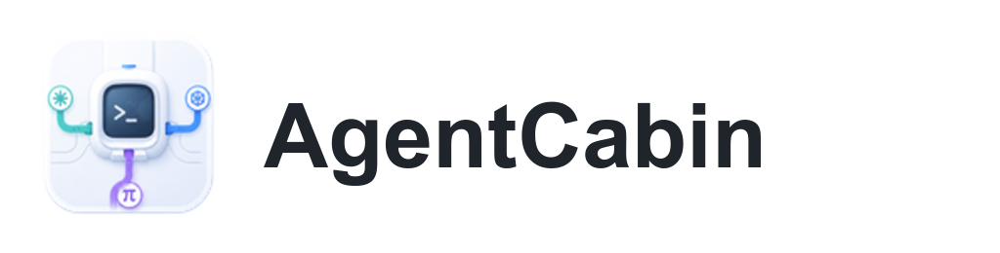
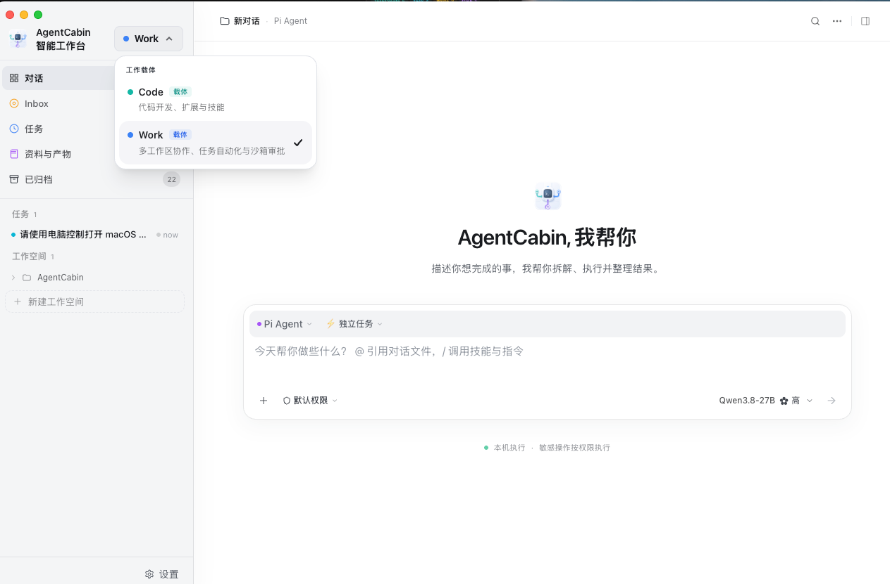

<p align="center">
  
</p>

<p align="center">
  <strong>AgentCabin Desktop —— 由 Pi Agent 驱动的本地优先 AI 编程工作台</strong>
</p>

<p align="center">
  一个由 <a href="https://github.com/earendil-works/pi">Pi Coding Agent</a> 驱动的开源 Electron + Rust 桌面应用 —— 提供 Code（极客开发）与 Work（自主工作流）两种工作模式，面向本地优先的 AI 结对编程体验。
</p>

<p align="center">
  如果你正在寻找 <strong>Pi 桌面端</strong>或<strong>AI 编程 Agent 工作台</strong>，AgentCabin 就是为这个场景构建的。
</p>

<p align="center">
  <a href="#agentcabin-desktop-是什么">AgentCabin 是什么</a> &middot;
  <a href="#核心能力">核心能力</a> &middot;
  <a href="#快速开始">快速开始</a> &middot;
  <a href="#支持的平台">平台</a> &middot;
  <a href="#架构">架构</a> &middot;
  <a href="#许可证">许可证</a>
</p>

<p align="center">
  <a href="README.md">English</a> | <b>简体中文</b>
</p>

---

<p align="center">
  
</p>

## AgentCabin Desktop 是什么？

AgentCabin Desktop 把分散在终端会话中的 AI 编程 Agent 带入一个持久化桌面工作台，全面由 Pi Agent 驱动。它将聊天、文件、工具输出、浏览器预览、会话历史、运行时管理和长期 Work 任务整合在原生应用中，同时默认保持项目数据**本地存储**。

它适合希望在桌面 UI 中使用 Pi Agent 和兼容 AI 模型提供方（包括 DeepSeek、Anthropic、OpenAI 等标准兼容端点），同时又不希望把代码仓库迁移到托管服务中的开发者。调用远程模型 API 仍然需要联网；AgentCabin 本身没有云端后台。

常用检索关键词：`AgentCabin`、`Pi`、`Pi Agent`、`Pi Coding Agent`、`Pi desktop`、`AI agent desktop`、`AI coding agent desktop`、`Electron coding agent`、`local-first coding workspace`。

## 检索关键词

AgentCabin 是一个面向 Pi Coding Agent 的开源桌面应用，也可以理解为 Pi 桌面端、Electron AI 编程 Agent 工作台和本地优先开发工作台。

### 项目概览

| | 说明 |
|---|---|
| 产品 | AgentCabin Desktop |
| 类别 | 开源 AI 编程 Agent 桌面端 / 本地优先开发工作台 |
| Agent 引擎 | Pi Coding Agent |
| 模式 | Code：交互式开发；Work：持久任务、审批、恢复、产物和定时执行 |
| 运行时闭包 | Node.js 22.19.0、Pi 0.85.1、pnpm 10.15.0 |
| 技术栈 | Electron、Svelte 5、SvelteKit、Rust、TypeScript |
| 许可证 | Apache License 2.0 |

> **打包版本包含应用自有的运行时闭包。**
>
> 当前闭包固定 Node.js 22.19.0、Pi 0.85.1、pnpm 10.15.0，以及 Code/Work 所需的 Pi 扩展。开发构建也可以使用本地准备好的运行时目录。
>
> 官方打包目标为 **macOS Apple Silicon**（`arm64`），最低 macOS 版本为 13.0。Windows 与 Linux 保留源码级兼容，作为社区构建目标。

**核心原则**：封装 CLI，可视化工作，数据本地化。

## 核心能力

### CLI 不提供、AgentCabin 补上的

| 能力 | AgentCabin 增加了什么 |
|------|----------------------|
| **可视化工具卡片** | 每个工具调用（Read、Edit、Bash、Grep、Write、WebFetch……）都渲染为内联卡片，带语法高亮 Diff、结构化输出和一键复制 |
| **运行历史与回放** | 浏览所有历史会话，完整事件回放，从任意节点恢复 / 分叉，支持软删除和恢复 |
| **浏览器远程访问** | 内嵌 Web 服务器，支持局域网浏览器访问或通过 HTTP 隧道（ngrok / cloudflared）远程访问 |
| **文件浏览器** | 浏览和编辑项目文件，支持语法高亮、Markdown 预览、图片预览和 Git Diff 查看 |
| **Memory 编辑器** | 创建和编辑 CLAUDE.md、项目级和用户级 Memory 文件，支持实时预览 |
| **Agent 管理** | 可视化编辑器创建、编辑、管理自定义 Agent 定义（.md 文件），支持表单模式和源码模式 |
| **权限规则管理** | 可视化管理 CLI 权限允许/拒绝规则，支持用户级和项目级配置 |
| **用量分析** | 按模型的 Token 分解、成本追踪、每日热力图、模型堆叠图表、会话级统计 |
| **活动监控** | 实时 Hook 事件流、工具活动时间线、文件追踪面板、嵌套工具卡片的子 Agent 追踪 |
| **MCP 管理** | 发现 MCP 服务器、查看逐服务器状态、一键重连 / 启停 |
| **内联权限审查** | 丰富的权限审查 UI，批量允许/拒绝面板、CLI 建议的"始终允许"规则、AskUserQuestion 渲染 |
| **Rewind 回退** | 检查点式文件回退，支持 dry-run 预览和逐文件选择 |
| **远程主机** | 配置 SSH 远程主机执行 CLI，支持密钥生成向导和连接测试 |
| **预览与元素选取** | 在伴侣窗口中打开 localhost 预览，交互式选取页面元素，将结构化上下文（DOM 路径、样式、HTML 片段）插入对话 |
| **Ralph 循环** | 自动迭代同一提示直到完成条件满足——免手动编码，支持自定义最大迭代次数 |
| **系统诊断** | CLI、平台、SSH 和代理配置的系统健康检查 |
| **Code 与 Work 模式** | Code 面向交互式开发；Work 面向持久任务、Inbox 审批、策略、产物、恢复和定时执行 |
| **内嵌浏览器** | Electron 自有 Chromium 页面，支持导航策略、localhost 预览、CDP 中继和元素/上下文采集 |
| **电脑控制** | 带可见审批和结构化上下文注入的 Desktop Use 能力 |

### 更多功能

- **富文本聊天 UI** — Markdown、语法高亮、思考块、图片附件、文件 Diff、工具突发折叠分组
- **会话控制** — 创建、恢复、分叉、重命名会话；计划模式切换；模型热切换；上下文历史追踪
- **拖拽上传** — 原生文件拖拽，支持图片、PDF、目录和路径引用
- **项目文件夹** — 侧栏项目选择器，Memory、权限和会话按项目隔离
- **内联斜杠命令** — `/model`、`/diff`、`/todos`、`/tasks`、`/doctor`、`/copy`、`/stats`、`/preview`、`/ralph` 等——在应用内原生渲染
- **快捷键** — 完全可自定义的键绑定，支持组合键和冲突检测
- **Hook 管理** — 配置上游 CLI Hook，实现事件驱动自动化
- **国际化** — 轻量响应式运行时，支持英文和简体中文
- **系统托盘** — 最小化到托盘；后台会话持续运行，支持原生通知
- **深色 / 浅色主题** — 基于 CSS 变量的主题系统，支持 UI 缩放
- **自动更新** — 应用内更新检测与下载链接
- **安装向导** — 首次启动引导 CLI 检测、认证和平台配置

## 快速开始

### 方式 A：下载预编译包（macOS Apple Silicon）

从项目的发布页面下载最新 `.dmg`（macOS Apple Silicon / `arm64`）。

> **注意**：应用未经代码签名。首次启动时，右键点击应用选择"打开"以绕过 macOS Gatekeeper。

### 方式 B：自动安装（macOS）

克隆项目后，在项目目录中执行：

```bash
cd AgentCabin
./scripts/setup.sh          # 加 --yes 跳过确认提示
npm run electron:dev
```

安装脚本自动检测并安装缺少的开发依赖（Xcode CLI Tools、Homebrew、Node.js、Rust 和 Pi 运行时）。

### 方式 C：手动安装

**前置条件：**

- [Node.js](https://nodejs.org/) >= 22.19.0
- [Rust](https://rustup.rs/) >= 1.75

**macOS：**
```bash
xcode-select --install
brew install node
curl --proto '=https' --tlsv1.2 -sSf https://sh.rustup.rs | sh
```

**Linux (Debian/Ubuntu)：**
```bash
sudo apt install libwebkit2gtk-4.1-dev build-essential curl wget file \
  libxdo-dev libssl-dev libayatana-appindicator3-dev librsvg2-dev
curl --proto '=https' --tlsv1.2 -sSf https://sh.rustup.rs | sh
```

**Windows：**
```powershell
# 从 https://rustup.rs 安装 Rust
# 从 https://nodejs.org 安装 Node.js
```

**构建与运行：**

```bash
cd AgentCabin
npm install
npm run electron:dev
```

### 安装向导

首次启动时，AgentCabin 会引导你完成：

1. **运行时检测** — 检测托管的 Pi Agent 和 DSH 运行时，并在需要时提供配置引导
2. **认证** — 配置 OpenAI / ChatGPT 账号，或填写自定义 Provider 的 API Key
3. **就绪** — 开始编程

你可以随时从**设置 > 通用 > 安装向导**重新运行。

## 支持的平台

当前配置保持精简：

| Provider | 配置方式 |
|----------|----------|
| OpenAI / ChatGPT | ChatGPT 官方订阅或 OpenAI 账号配置 |
| 自定义 Provider | 自定义名称、Base URL、API Key、API 格式和模型列表 |

可以在**设置 > 模型与提供商**中配置。自定义 Provider 配置完成后，可在对话中使用 `provider-id/model-name` 模型标识。

## 架构

AgentCabin 由安全的 Electron 桌面外壳和独立的 Rust Core 进程组成：

```text
Electron 宿主
├── Svelte 5 / SvelteKit 渲染层
│   ├── Code 工作台：Pi Agent 与 DSH
│   └── Work 工作台：任务、Inbox、策略、产物、恢复
├── preload bridge + 内嵌 Chromium / CDP 浏览器
└── Rust Core 进程
    ├── session actor 与事件总线
    ├── Provider 与 runtime 桥接
    ├── Work 编排与仅限桌面的执行
    └── ~/.agentcabin/ 下的本地 JSON/文件存储

托管运行时闭包
├── Node.js 22.19.0 + pnpm 10.15.0
├── Pi 0.85.1（RPC）
└── DSH 0.1.5-rc.2（ACP）
```

**技术栈：**

| 层级 | 技术 |
|------|------|
| 桌面外壳 | [Electron](https://www.electronjs.org/)（安全 BrowserWindow、preload bridge、内嵌 Chromium） |
| Core | Rust headless 进程，负责 session actor、存储、Work 编排和 Provider 桥接 |
| 前端 | [Svelte 5](https://svelte.dev/) + [SvelteKit](https://svelte.dev/docs/kit/)（adapter-static） |
| 样式 | [Tailwind CSS](https://tailwindcss.com/) v3 + CSS 变量 |
| 终端 | [xterm.js](https://xtermjs.org/) |
| Markdown | [marked](https://marked.js.org/) + [highlight.js](https://highlightjs.org/) + [DOMPurify](https://github.com/cure53/DOMPurify) |
| 国际化 | 轻量自建运行时 (en + zh-CN) |
| 测试 | [Vitest](https://vitest.dev/) |

**Agent 通信：**

每个会话都是由独立的 session actor 管理的长连接多轮进程。**Pi Agent** 使用长连接 JSONL RPC。**DSH** 使用托管的 Code/Work 配置和 Provider 桥接。Work 运行仅限桌面端，并在同一个本地 Core 之上增加任务状态、Inbox/审批、策略、产物、恢复和可选定时执行。

**数据存储：**

所有数据本地存储在 `~/.agentcabin/` —— 无云端，无数据库。

```
~/.agentcabin/
├── settings.json          # 用户设置
├── runs/                  # 会话历史
│   └── {run-id}/
│       ├── meta.json      # 运行元数据
│       ├── events.jsonl   # 事件日志
│       └── artifacts.json # 摘要
└── keybindings.json       # 自定义快捷键
```

## 开发

```bash
npm install                 # 安装依赖
npm run electron:dev        # Electron + Vite + Rust core 开发模式
npm test                    # 运行测试
npm run check               # Svelte/类型检查
npm run lint                # ESLint
npm run format:check        # Prettier 检查
npm run package             # 构建 macOS DMG/ZIP 并执行打包运行时 smoke test
```

## 参与贡献

欢迎贡献！Bug 报告、功能建议和 Pull Request 都很受欢迎。

## 许可证

基于 [Apache License 2.0](LICENSE) 许可。

Copyright 2025-2026 AgentCabin Contributors.
